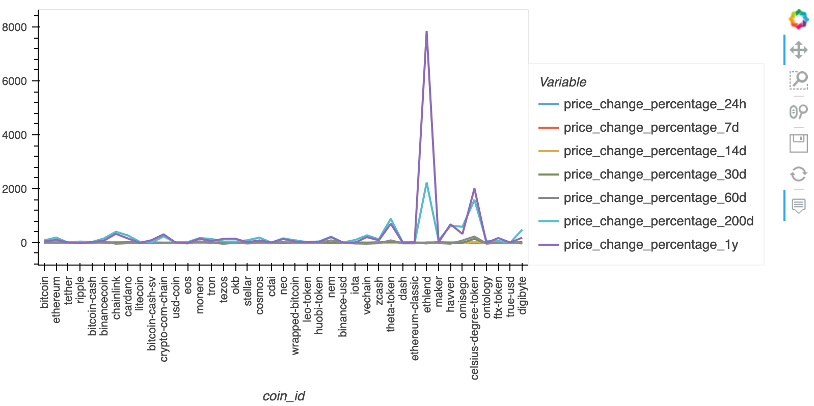
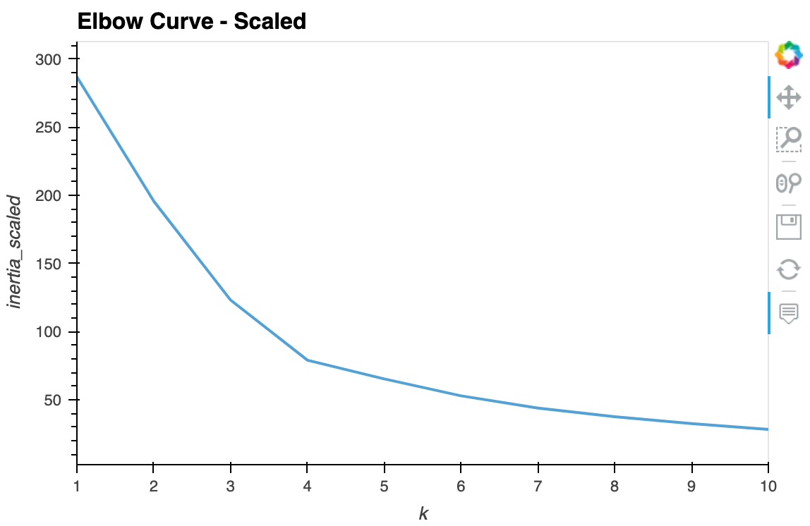
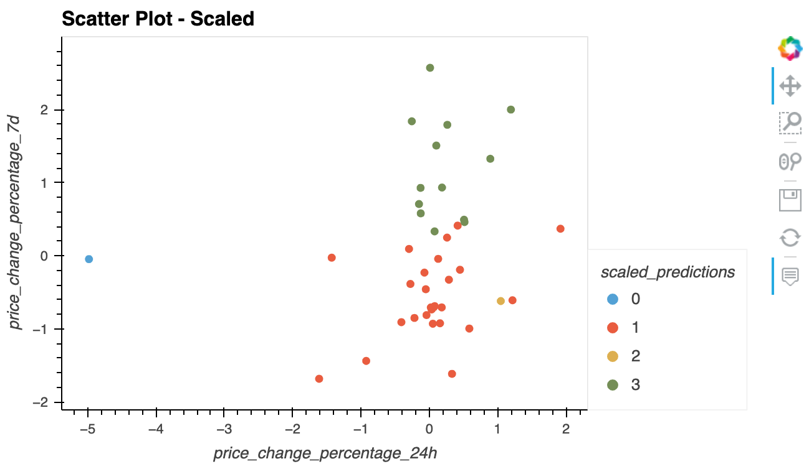
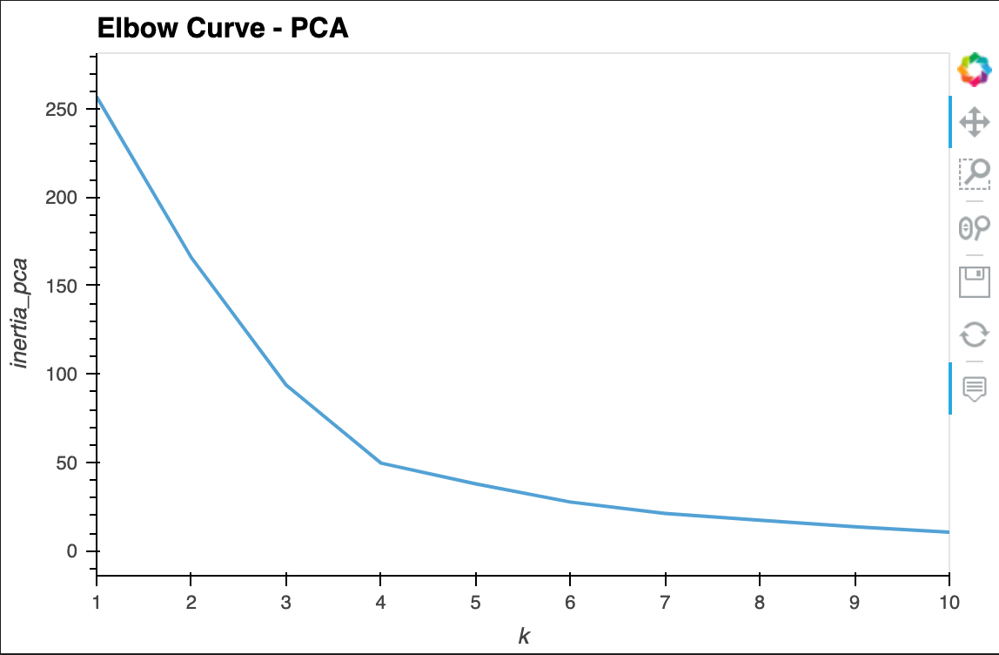
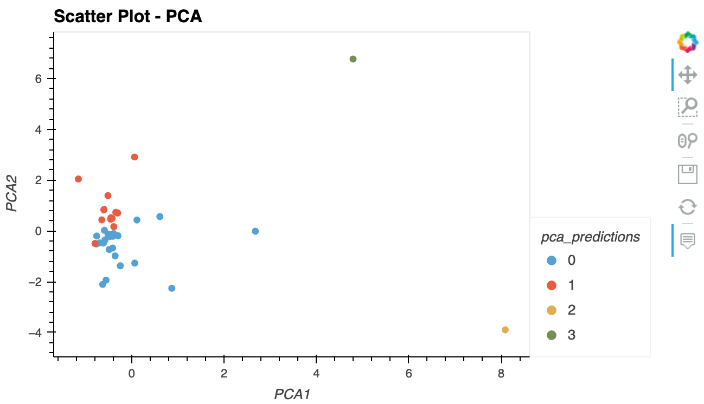

# crypto_investments
Module 10

**The application is published [here](http://avangelinac.github.io/crypto_investments) as a github project page.**

---
## Installation Instructions
- ### Install [Selenium](https://selenium-python.readthedocs.io/) to use [bokeh.io](https://docs.bokeh.org/en/latest/) image export functions
```shell
conda install selenium
```
and
```shell
conda install -c conda-forge firefox geckodriver
```
- ### To publish this notebook as HTML use [Voila](https://voila.readthedocs.io/en/stable/index.html):
```shell 
conda install -c conda-forge voila
```

---
## Usage
To run the notebook from the command line use:
```shell
voila crypto_investments.ipynb
```

---
## Examples
- ### Example 1

- ### Example 2

- ### Example 3

- ### Example 4

- ### Example 5


---
## Contributors
Initial Avangelina Cazares. 

---
## Disclaimer
Not financial advice

---
## License
None & Open Source